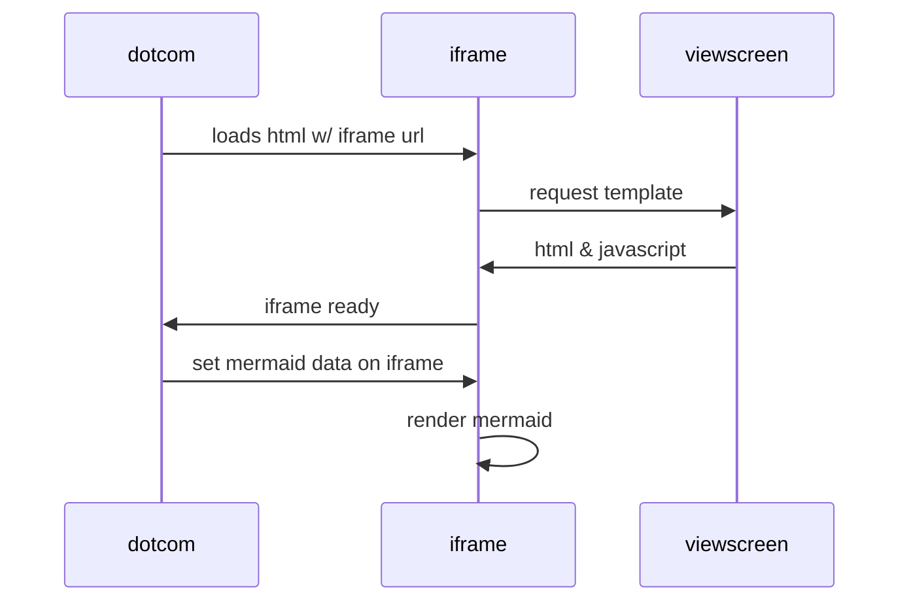

```geojson
{
  "type": "Polygon",
  "coordinates": [
      [
          [-90,30],
          [-90,35],
          [-90,35],
          [-85,35],
          [-85,30]
      ]
  ]
}
```

### Here's a topoJSON map in markdown

```topojson
 {"type":"Topology","transform":{"scale":[0.003589294092944858,0.0005371535195261037],"translate":[-179.1473400003406,17.67439566600018]},"objects":{"counties":   {"type":"GeometryCollection","geometries":[{"type":"MultiPolygon","arcs":[[[0,1,2,3]]],"id":53073},{"type":"Polygon","arcs":[[4,5,6,7,8,9]],"id":30105},{"type":"Polygon","arcs": [[10,11,12,1
 ...
```


```stl
solid cube_corner
  facet normal 0.0 -1.0 0.0
    outer loop
      vertex 0.0 0.0 0.0
      vertex 1.0 0.0 0.0
      vertex 0.0 0.0 1.0
    endloop
  endfacet
  ...
```
