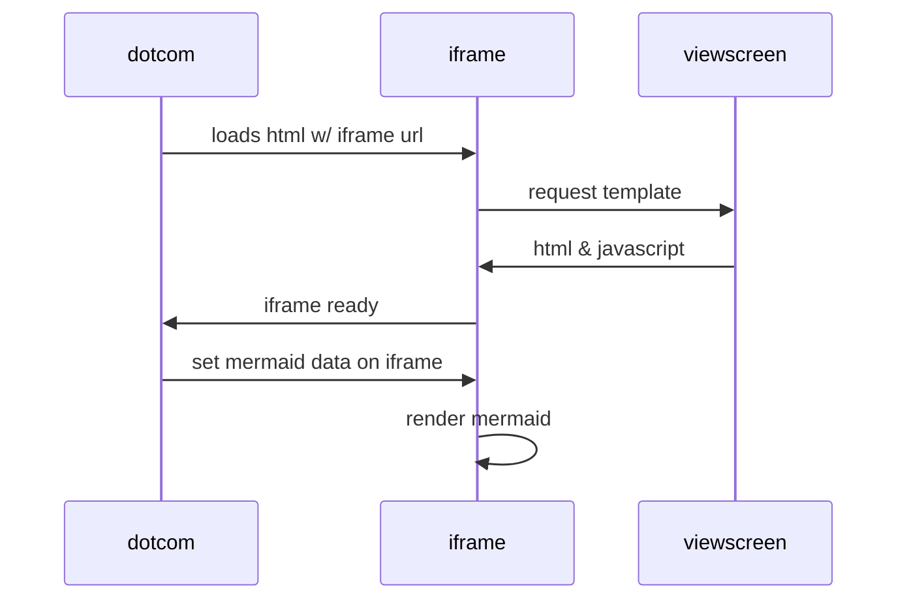

```geojson
{
  "type": "Polygon",
  "coordinates": [
      [
          [-90,30],
          [-90,35],
          [-90,35],
          [-85,35],
          [-85,30]
      ]
  ]
}
```

### Here's a topoJSON map in markdown

```topojson
{
  "type": "Topology",
  "transform": {
    "scale": [0.0005000500050005, 0.00010001000100010001],
    "translate": [100, 0]
  },
  "objects": {
    "example": {
      "type": "GeometryCollection",
      "geometries": [
        {
          "type": "Point",
          "properties": {"prop0": "value0"},
          "coordinates": [4000, 5000]
        },
        {
          "type": "LineString",
          "properties": {"prop0": "value0", "prop1": 0},
          "arcs": [0]
        },
        {
          "type": "Polygon",
          "properties": {"prop0": "value0",
            "prop1": {"this": "that"}
          },
          "arcs": [[1]]
        }
      ]
    }
  },
  "arcs": [[[4000, 0], [1999, 9999], [2000, -9999], [2000, 9999]],[[0, 0], [0, 9999], [2000, 0], [0, -9999], [-2000, 0]]]
}
```


```stl
solid Mesh
  facet normal -0.000000 1.000000 0.000000
    outer loop
      vertex 15.337000 15.000000 109.000000
      vertex 15.337000 15.000000 139.000000
      vertex 99.000000 15.000000 0.000000
    endloop
  endfacet
endsolid Mesh
```
